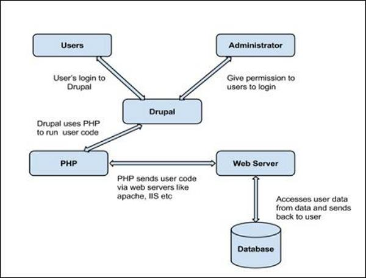

# ProjectBGroup2 : Kevin, Hadi, Christophe

# JOURNAL DE BORD

# OBJECTIF: Transformer une application monolithique en micro-services

 ---------------------------------------------------------------------------------------------------------------------------------
# JOUR 1 :

# APPLICATION MONOLITHIQUE VERSUS APPLICATION EN MICRO-SERVICES

### 1) Présentation de l’architecture monolithique ? Points forts / Points faibles

### 2) Présentation de l’architecture de microservices ? Points forts / Points faibles

### 3) Microservices et architecture monolithique : DIFFERENCES ?

 
## 1 ) Présentation de l’architecture monolithique ? 

L’architecture monolithique est considérée comme une manière traditionnelle de construire des applications. Une application monolithique est construite comme une unité unique et indivisible. Habituellement, une telle solution comprend une interface utilisateur côté client, une application côté serveur et une base de données. Elle est unifiée et toutes les fonctions sont gérées et servies en un seul endroit.

Normalement, les applications monolithiques ont une seule grande base de code et manquent de modularité. Si les développeurs veulent mettre à jour ou modifier quelque chose, ils accèdent à la même base de code. Ils apportent donc des modifications à l’ensemble de la stack en une seule fois.

 
### POINTS FORTS DE L'ARCHITECTURE MONOLITHIQUE : 

Moins de problèmes transversaux

Les préoccupations transversales sont celles qui affectent l’ensemble de l’application, comme la journalisation, la manipulation, la mise en cache et le contrôle des performances. 

Dans une application monolithique, ce domaine de fonctionnalité ne concerne qu’une seule application, il est donc plus facile de le gérer.
 
Débogage et tests plus faciles

Contrairement à l’architecture microservices, les applications monolithiques sont beaucoup plus faciles à déboguer et à tester. Puisqu’une application monolithique est une unité unique et indivisible, vous pouvez effectuer des tests de bout en bout beaucoup plus rapidement.

 
Simplicité de déploiement

Un autre avantage associé à la simplicité des applications monolithiques est la facilité de déploiement. Avec les applications monolithiques, vous n’avez pas à gérer de nombreux déploiements, mais seulement un fichier ou un répertoire.

 
Simplicité de développement

Tant que l’approche monolithique est une méthode standard de création d’applications, toute équipe d’ingénieurs dispose des connaissances et des capacités nécessaires pour développer une application monolithique.

 
### POINTS FAIBLES DE L'ARCHITECTURE MONOLITHIQUE

La compréhension

Lorsqu’une application monolithique évolue, elle devient trop compliquée à comprendre. En outre, un système complexe de code au sein d’une application est difficile à gérer.

 
Apporter des modifications

Il est plus difficile de mettre en œuvre des changements dans une application aussi vaste et complexe avec un couplage très étroit. Toute modification du code affecte l’ensemble du système et doit donc être minutieusement coordonnée. Cela rend le processus de développement global beaucoup plus long.

 
L’évolution

Il n’est pas possible de faire évoluer les composants de manière indépendante, mais uniquement l’application dans son ensemble.

 
Les obstacles liés aux nouvelles technologies

Il est extrêmement difficile d’appliquer une nouvelle technologie à une application monolithique, car il faut alors réécrire l’ensemble de l’application.

 
## 2 ) PRESENTATION DE L'ARCHITECTURE MICROSERVICES

Alors qu’une application monolithique est une seule unité unifiée, une architecture microservices la décompose en un ensemble de petites unités indépendantes. Ces unités exécutent chaque processus d’application comme un service distinct. Ainsi, tous les services possèdent leur propre logique et leur propre base de données et exécutent les fonctions spécifiques.

 

Dans une architecture microservices, l’ensemble de la fonctionnalité est divisé en modules déployables indépendamment qui communiquent entre eux par le biais de méthodes définies appelées API (Application Programming Interface). Chaque service couvre sa propre portée et peut être mis à jour, déployé et mis à l’échelle indépendamment.

 
#### a ) POINTS FORTS DE L'ARCHITECTURE MICROSERVICES :

Composants indépendants

Premièrement, tous les services peuvent être déployés et mis à jour indépendamment, ce qui donne plus de flexibilité. Deuxièmement, un bogue en microservices n’a d’impact que sur ce service particulier et n’influence pas l’ensemble de l’application. Enfin, il est beaucoup plus facile d’ajouter de nouvelles fonctionnalités à une application microservices qu’à une application monolithique.

 
Une compréhension plus aisée

Divisée en composants plus petits et plus simples, une application microservice est plus facile à comprendre et à gérer. Il suffit de se concentrer sur un service spécifique lié à un objectif commercial que vous avez.

 
Meilleure évolutivité

Un autre avantage de l’approche microservices est que chaque élément peut être mis à l’échelle indépendamment. L’ensemble du processus est donc plus rentable et plus rapide qu’avec les monolithes, où l’application entière doit être mise à l’échelle même si elle n’en a pas besoin. En outre, chaque monolithe a des limites en termes d’évolutivité, de sorte que plus le nombre d’utilisateurs augmente, plus le monolithe pose des problèmes. Par conséquent, de nombreuses entreprises finissent par reconstruire leurs architectures monolithiques.

 
Flexibilité dans le choix de la technologie

Les équipes d’ingénieurs ne sont pas limitées par la technologie choisie dès le départ. Elles sont libres d’appliquer diverses technologies et frameworks pour chaque microservice.

 
Le niveau supérieur d’agilité

Toute défaillance dans une application microservices n’affecte qu’un service particulier et non l’ensemble de la solution. Ainsi, tous les changements et toutes les expériences sont mis en œuvre avec moins de risques et moins d’erreurs.

  
### POINTS FAIBLES DE L'ARCHITECTURE MICROSERVICES :

 
Une complexité supplémentaire

Une architecture de microservices étant un système distribué, vous devez choisir et configurer les connexions entre tous les modules et bases de données. En outre, tant qu’une telle application comprend des services indépendants, ils doivent tous être déployés indépendamment.

 
Distribution du système

Une architecture de microservices est un système complexe composé de plusieurs modules et bases de données, toutes les connexions doivent donc être gérées avec soin.

 
Préoccupations transversales

Lors de la création d’une application microservices, vous devrez gérer un certain nombre de problèmes transversaux. Il s’agit notamment de la configuration externalisée, de la journalisation, des métriques, des contrôles de santé, etc.

 
Test

Une multitude de composants déployables indépendamment rend le test d’une solution basée sur les microservices beaucoup plus difficile.

 
### 7 ) DIFFERENCES ENTRE ARCHITECTURE MICROSERVICES ET MONOLITHIQUES

Analyse de la complexité, la fiabilité, la latence et l’évolutivité de l’architecture monolithique par rapport aux microservices afin de mieux comprendre les différences.
 
Évolutivité

Les microservices ne sont pas les seuls à être évolutifs. Un monolithe peut également être mis à l’échelle. Toutefois, les applications monolithiques peuvent être mises à l’échelle dans une seule dimension et en exécutant plusieurs copies. Avec un volume de données croissant, vous ne serez pas en mesure de les faire évoluer. Une application microservices peut donc évoluer avec moins de ressources, ce qui est un avantage absolu des microservices.

 
Complexité

Les microservices impliquent une pléthore de codes sources, de frameworks et de technologies en fonction de la complexité de votre application. Plusieurs serveurs peuvent héberger les services, qui communiquent entre eux via des API.

L’architecture de ce type nécessite une méthodologie de développement différente et exige un niveau plus élevé de coordination, de compétences et de compréhension de l’architecture globale.

 
Latence

La latence d’une entité fait référence au temps qui s’écoule entre la stimulation et la réponse qui se produit après un certain changement physique. Les microservices sont principalement concernés par ce phénomène. Un microservice envoie ou reçoit des données en octets sur le réseau lorsqu’il communique avec un autre service. Les octets deviennent des signaux électriques, qui redeviennent des octets.

 

Les monolithes, en revanche, ne connaissent pas de latence réseau puisque tous les services sont situés dans le même flux de travail. Pour ces raisons, les microservices sont plus lents que les monolithes.

 
Fiabilité

Un monolithe se compose d’un seul serveur où se déroulent tous les appels et processus. En d’autres termes, si le réseau tombe en panne, c’est toute l’application qui s’arrête. En revanche, les appels réseau des microservices sont fiables à 99,9 %. Lorsqu’un des microservices tombe en panne, l’isolation des erreurs, une autre fonctionnalité des microservices, vous permet de maintenir l’application.

---------------------------------------------------------------------------------------------------------------------------------

[From Monolith to Microservices: A Guide To Replatforming](https://fabric.inc/blog/commerce/from-monolith-to-microservices)

---------------------------------------------------------------------------------------------------------------------------------

## II ) CHOIX DE L'APPLICATION CMS A MIGRER : DRUPAL

### PRESENTATION ET ANALYSE DE L'ARCHITECTURE:

Users − These are the users on the Drupal community. The user sends a request to a server using Drupal CMS and web browsers, search engines, etc. acts like clients.

Administrator − Administrator can provide access permission to authorized users and will be able to block unauthorized access. Administrative account will be having all privileges for managing content and administering the site.

Drupal − Drupal is a free and open source Content Management System (CMS) that allows organizing, managing and publishing your content and is built on PHP based environments. Drupal CMS is very flexible and powerful and can be used for building large, complex sites. It is very easy to interact with other sites and technologies using Drupal CMS. Further, you will be able to handle complex forms and workflows.

PHP − Drupal uses PHP in order to work with an application which is created by a user. It takes the help of web server to fetch data from the database. PHP memory requirements depend on the modules which are used in your site. Drupal 6 requires at least 16MB, Drupal 7 requires 32MB and Drupal 8 requires 64MB.

Web Server − Web server is a server where the user interacts and processes requests via HTTP (Hyper Text Transfer Protocol) and serves files that form web pages to web users. The communication between the user and the server takes place using HTTP. You can use different types of web servers such as Apache, IIS, Nginx, Lighttpd, etc.

Database − Database stores the user information, content and other required data of the site. It is used to store the administrative information to manage the Drupal site. Drupal uses the database to extract the data and enables to store, modify and update the database.

---------------------------------------------------------------------------------------------------------------------------------
# JOUR 2

## AUTOMATISATION  DE L'INSTALLATION DE DRUPAL ( JOUR 2 + 3)

CONTENEURISATION AVEC DOCKER COMPOSE :
 - UN CONTENEUR MYSQL
 - UN CONTENEUR DRUPAL

Image docker: docker pull drupal:7.98-php8.2-fpm-bullseye

Fichier Docker Compose : Docker compose drupal + msql.png

##  IDENTIFICATION DES DIFFERENTES FONCTIONNALITES MIGRABLES :

### 1- Gestion d'utilisateurs et d'authentification :
      Créer un micro-service pour gérer l'authentification, l'inscription des utilisateurs et la gestion des profils. Cela 
      pourrait permettre aux utilisateurs de s'authentifier de manière centralisée, même si d'autres parties de l'application 
      sont déployées en micro-services distincts.
### 2- Notifications : 
       Créer un micro-service pour gérer l'envoi de notifications par e-mail, SMS ou d'autres canaux.
### 3- Analyse et suivi :
       Créer un micro-service pour collecter et analyser les données de suivi et les statistiques d'utilisation.
       

## MISE EN PLACE D'UN MICRO SERVICE : AJOUTER UN ARTICLE SUR LE SITE EN DEMO

### Extension Services Web: Installation du module JSON:API  pour exposer les entités en tant qu'API web JSON:API-specification-compliant

http://localhost:8080/jsonapi

http://localhost:8080/jsonapi/node/article

### Extension Services Web: Installation du module HTTP Basic Authentification:
Installé
	Nom
	Description
	HTTP Basic Authentication 	
Provides an HTTP Basic authentication provider.
Nom système : basic_auth
Version : 10.1.2
 

### Authentication API overview (https://www.drupal.org/docs/8/api/authentication-api/overview)

Setup Access Token / OAuth Based Authentication (https://www.drupal.org/docs/contributed-modules/api-authentication/setup-access-token-oauth-based-authentication)

Installation du module : RESTful Web Services (Drupal REST & JSON API Authentication)

Drupal REST & JSON API Authentication module restricts and secures unauthorized access to your Drupal site APIs using different authentication methods including Basic Authentication , API Key Authentication , JWT Authentication , OAuth Authentication , External / Third-Party Provider Authentication, etc:

 CHOIX DE L'AUTHENTIFICATION => BASIC AUTHENTIFICATION

A REST API defines a set of functions in which developers can perform requests such as GET, POST, PUT, PATCH, DELETE, and receive responses via HTTP protocol. For example, when a client application calls a Drupal API to fetch a specific user (the resource), the API will return the state of that user, including their name, email, user id, etc.

Routing system overview (https://www.drupal.org/docs/drupal-apis/routing-system/routing-system-overview)

---------------------------------------------------------------------------------------------------------------------------------
JOUR 3:

### FIN DE L'AUTOMATISATION  DE L'INSTALLATION DE DRUPAL ( JOUR 2 + 3)

### CREATION DU CODE PYTHON SOUS FLASK DU MICRO-SERVICE permettant d'ajouter un article au site.

### UTILISATION DE THUNDERBIRD SOUS VSCODE POUR TESTER L'API DU MICROSERVICE (GET, POST)

---------------------------------------------------------------------------------------------------------------------------------
JOUR 4:

### FEUILLE DE ROUTE POUR LE DEVELOPPEMENT DU MICRO SERVICE :

1. Configuration de l'environnement :
Installation de Flask, SQLAlchemy et autres dépendances nécessaires.
Configuration de la base de données pour le micro-service.
2. Connexion au monolithe PrestaShop :
Utilisation de la bibliothèque requests pour intégrer l'API REST de DRUPAL.
3. Définition du modèle de données :
Modélisation de la commande dans SQLAlchemy.
4. Implémentation des routes :
Création de routes pour l'ajout au panier, la vérification des disponibilités, et
d'autres actions nécessaires.
5. Gestion des erreurs :
Ajout de gestionnaires d'erreurs pour traiter les réponses non 200, les
timeouts, etc.
6. Optimisation et sécurité :
Mise en cache des réponses fréquemment utilisées.
Gestion des taux d'appels à l'API pour respecter les limites imposées.

## DEBUT PHASE DE CREATION DES TESTS MICRO_SERVICE.PY AVEC PYTEST

## DEFINITION DU MODELE DE DONNEES :
Modélisation de la commande dans SQLAlchemy.

## 5. GESTION DES ERREURS (EN COURS)
Ajout de gestionnaires d'erreurs pour traiter les réponses non 200, les
timeouts, etc.

---------------------------------------------------------------------------------------------------------------------------------
## JOUR 5:

## OPTIMISATION DU MICRO-SERVICE

### 1) Mise en cache des réponses fréquemment utilisées avec REDIS

### 2 ) Gestion des taux d'appels à l'API pour respecter les limites imposées avec Flask-Limiter

## SECURISATION DU MICRO-SERVICE

### 1 ) Installation de Python-Decouple
Pour sécuriser la clé API de DRUPAL  : Plutôt que de la stocker dans config.py ,
utilisez des variables d'environnement. Vous pouvez utiliser python-decouple pour
aider à gérer cela.

### Création Docker File sur une base de déploiement Gunicorn pour notre Micro-Service

### ETUDE MISE EN PLACE D'UN CONTENEUR NGINX (pour sécuriser les échanges entre les utilisateurs et notre DRUPAL):

Création en cours du fichier nginx.conf qui sera injecté dans le docker conteneur NGINX

----------------------------------------------------------------------------------------------------------------------------------------
 ## JOUR 6:

### INSTALLATION DU CERTIFICAT SSL SUR LE CONTENEUR DRUPAL
  
 ### MISE EN PLACE DE LA BASE DE DONNEES AVEC SQL ALCHEMY

 ### TRACKING DE L'ID DES REQUETES DANS DRUPAL

 ----------------------------------------------------------------------------------------------------------------------------------------
## JOUR 7  : OBJECTIFS

### FINIR LA ROUTE DE LA SECONDE PARTIE DU MICRO-SERVICE PERMETTANT DE DELETE UN ARTICLE (validé)

### DOCKERISER LE MICROSERVICE (validé)

### INSTALLER NGINX ET CONFIGURER LE CERTIFICAT SUR LE CONTENEUR

### CREATION D'UN FRONT END POUR NOTRE MICRO-SERVICE : GRAPHICAL USER INTERFACE (HADI) => Ajout d'article / Suppression d'article

----------------------------------------------------------------------------------------------------------------------------------------
## JOUR 8 :

### PROJECTION AUTOMATISATION VIA JENKINS CI/CD

 
 
 
 
 EN ATTENTE : TEST ADDITIONNEL Utiliser pyflakes 3.1.0 (pip install pyflakes)

 

 

